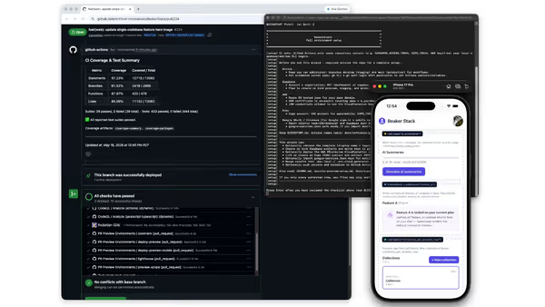
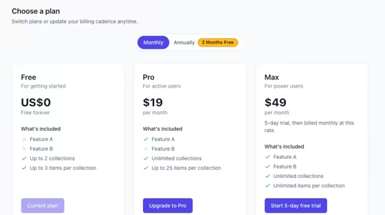
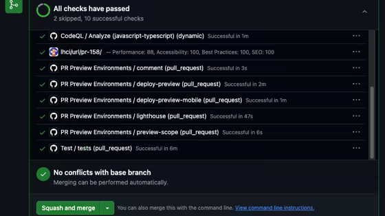
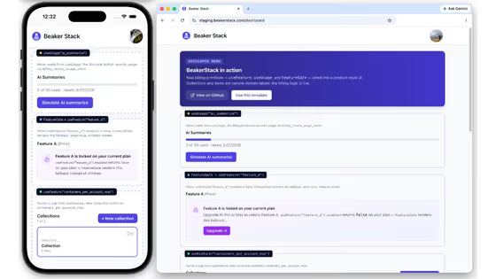

# BeakerStack

**Ship your SaaS faster.**

[](https://github.com/Artificer-Innovations/BeakerStack/actions/workflows/test.yml)
[](LICENSE)
[](package.json)
[](https://github.com/Artificer-Innovations/BeakerStack/releases/tag/2026.001)
[](https://github.com/Artificer-Innovations/BeakerStack/discussions)

BeakerStack is the foundation we wished existed for shipping real B2C SaaS: **one product, two surfaces, one backend, one deploy pipeline**. Web and mobile from a shared codebase, auth and billing past the demo, a three-environment pipeline that catches mistakes before production, and a structure that AI coding agents can modify without breaking things.

React + Vite on the web. React Native + Expo on mobile. Supabase underneath. Stripe when you take money.



[beakerstack.com](https://beakerstack.com) · [Quick start](QUICKSTART.md) · [Releases](https://github.com/Artificer-Innovations/BeakerStack/releases)

## Why this shape

**The wedge.** A credible B2C app needs web, iOS, Android, auth, billing, entitlements, and a marketing site that ranks — not eventually, from day one. Most templates give you one slice. Stitching the rest is a four-to-six-week integration project before you write product code. BeakerStack is that work already done, in a shape that still holds when you customize it.

**One codebase, not three products that drift.** The slow death of cross-platform apps is duplicated business logic: validation on web, different validation on mobile, billing hooks that only exist on one surface. Shared hooks, shared types, shared billing in `packages/shared` mean one bug, one fix, three platforms. That is not a reuse percentage; it is how you keep “one product” true after the fork.

**Three environments because “works on my machine” is not a release strategy.** B2C apps that take payments cannot ship migrations that break production, and stakeholders need to click a feature in a PR, not read a diff. BeakerStack mirrors your branch model in Supabase — local Docker, shared PR preview DB, staging on `develop`, production on `main` — and deploys path-based web previews so the artifact under review is the running change.

The test pyramid (unit, integration, E2E, database) catches regressions across web and mobile in a single PR, before merge. Optional EAS Update channels align mobile to the same preview → staging → production flow.

**Built for AI coding agents.** Dozens of full-stack templates exist. Few say plainly: we designed this to be modified by AI coding agents, and here is how. Typed landing and billing configs fail loudly instead of silently rendering wrong copy. Schema-generated types tie the database to TypeScript so an agent cannot drift from RLS reality. Tests are colocated with a documented decision matrix so an agent knows where new coverage belongs. Monorepo boundaries scope changes. When an agent still ships something broken, PR previews and CI are the safety net — not hope.

**Fork the template; update the packages.** Every template fork diverges immediately — that is fine. BeakerStack does two things about it. **CalVer tags** (`2026.001`, …) mark exact snapshot baselines so you know what you forked and can merge upstream deliberately ([docs/UPGRADING.md](docs/UPGRADING.md)). Reusable pieces ship as **`@beakerstack/*` npm packages** (semver, Changesets) so you can bump test helpers or billing without re-merging the whole monorepo. See [docs/VERSIONING.md](docs/VERSIONING.md).

## Template + npm packages

| Distribution     | What it is                                                                                                                  |
| ---------------- | --------------------------------------------------------------------------------------------------------------------------- |
| **Template**     | Fork or “Use this template”; CalVer tags + [GitHub Releases](https://github.com/Artificer-Innovations/BeakerStack/releases) |
| **npm packages** | Optional `@beakerstack/*` for existing apps; semver via Changesets                                                          |

| Package                   | Status                                                                         | Install                            |
| ------------------------- | ------------------------------------------------------------------------------ | ---------------------------------- |
| `@beakerstack/test-utils` | Published on npm (`0.0.1`; workspace may show `0.0.0` until release PR merges) | `npm i -D @beakerstack/test-utils` |
| `@beakerstack/billing`    | In template (npm planned)                                                      | Workspace in fork today            |
| `@beakerstack/shared`     | In template (npm planned)                                                      | Workspace in fork today            |

## What's in the repo

Reference inventory — the argument is above.

| Area      | What you get                                                                                                        | Doc                                                              |
| --------- | ------------------------------------------------------------------------------------------------------------------- | ---------------------------------------------------------------- |
| Apps      | Web (Vite), mobile (Expo), shared `packages/*`                                                                      | [ARCHITECTURE](docs/ARCHITECTURE.md)                             |
| Auth      | Email/password, Google OAuth, optional Apple; RLS-first profiles; schema-generated types                            | [OAUTH](docs/OAUTH.md)                                           |
| Billing   | Stripe subscriptions (not one-off checkout-only), plan gates, customer portal, usage metering                       | [stripe-billing-setup](docs/stripe-billing-setup.md)             |
| Marketing | Config-driven landing; prerendered SEO home (canonical + Open Graph)                                                | [landing README](apps/web/src/components/landing/README.md)      |
| CI/CD     | Path-based PR previews on AWS (S3/CloudFront), staging on `develop`, production on `main`, EAS channels             | [pr-preview-setup](docs/pr-preview-setup.md)                     |
| Setup     | `npm run setup` / `setup:full` (local + optional full cloud)                                                        | [QUICKSTART](QUICKSTART.md)                                      |
| Tests     | Unit, integration, Maestro E2E, pgTAP DB tests; colocated with decision matrix                                      | [TESTING](docs/TESTING.md)                                       |
| Agents    | Typed configs, generated DB types, package boundaries, test placement rules — conventions in ARCHITECTURE + TESTING | [ARCHITECTURE](docs/ARCHITECTURE.md), [TESTING](docs/TESTING.md) |

Stack: React 18.2, Vite 5, Expo SDK ~50, React Native 0.73, Node 20 in CI.

## Screenshots

| Billing UI                                          | Environments pipeline                                                       | Web + mobile                                          |
| --------------------------------------------------- | --------------------------------------------------------------------------- | ----------------------------------------------------- |
|  |  |  |

## Quick start

```bash
git clone https://github.com/<your-org>/<your-repo>.git
cd <your-repo>
npm install
npm run setup
```

The setup wizard handles Docker Supabase, `.env.local`, and type generation. Full cloud + CI checklist: [QUICKSTART.md](QUICKSTART.md).

**Node 18+** (`>=18` in `package.json`); **Node 20** matches CI. Docker Desktop + Supabase CLI for local work.

### Renaming the template

```bash
npm run rename -- --from "Beaker Stack" --to "Your Product" --dry-run
```

[docs/renaming.md](docs/renaming.md)

## Project structure

```
BeakerStack/
├── apps/web, apps/mobile
├── packages/shared, packages/billing, packages/test-utils
├── supabase/          # migrations, Edge Functions
├── tests/             # integration & E2E
├── scripts/           # setup, deploy, codegen
└── docs/
```

## Documentation

| Topic          | Doc                                                          |
| -------------- | ------------------------------------------------------------ |
| First run      | [QUICKSTART.md](QUICKSTART.md)                               |
| All guides     | [docs/README.md](docs/README.md)                             |
| Development    | [docs/DEVELOPMENT.md](docs/DEVELOPMENT.md)                   |
| Architecture   | [docs/ARCHITECTURE.md](docs/ARCHITECTURE.md)                 |
| Versioning     | [docs/VERSIONING.md](docs/VERSIONING.md)                     |
| OAuth          | [docs/OAUTH.md](docs/OAUTH.md)                               |
| Stripe billing | [docs/stripe-billing-setup.md](docs/stripe-billing-setup.md) |
| Testing        | [docs/TESTING.md](docs/TESTING.md)                           |
| Mobile native  | [docs/guides/MOBILE.md](docs/guides/MOBILE.md)               |
| Contributing   | [CONTRIBUTING.md](CONTRIBUTING.md)                           |
| Security       | [SECURITY.md](SECURITY.md)                                   |

## Development

Day-to-day commands: [docs/DEVELOPMENT.md](docs/DEVELOPMENT.md). Native rebuilds and EAS: [docs/guides/MOBILE.md](docs/guides/MOBILE.md).

## Releases

Template: CalVer tags (`2026.001`, …), notes from conventional commits — [Releases](https://github.com/Artificer-Innovations/BeakerStack/releases). Packages: independent semver on npm.

## Contributing

Bug fixes, docs, agent-friendly structure improvements, and shared packages welcome. For larger changes, open a [Discussion](https://github.com/Artificer-Innovations/BeakerStack/discussions) first. Stack swaps (different auth, payments, or framework) belong in your fork — [CONTRIBUTING.md](CONTRIBUTING.md).

## License

[MIT](LICENSE)

## Built with

[Supabase](https://supabase.com), [Stripe](https://stripe.com), [React](https://react.dev), [React Native](https://reactnative.dev), [Expo](https://expo.dev), [Vite](https://vitejs.dev).
